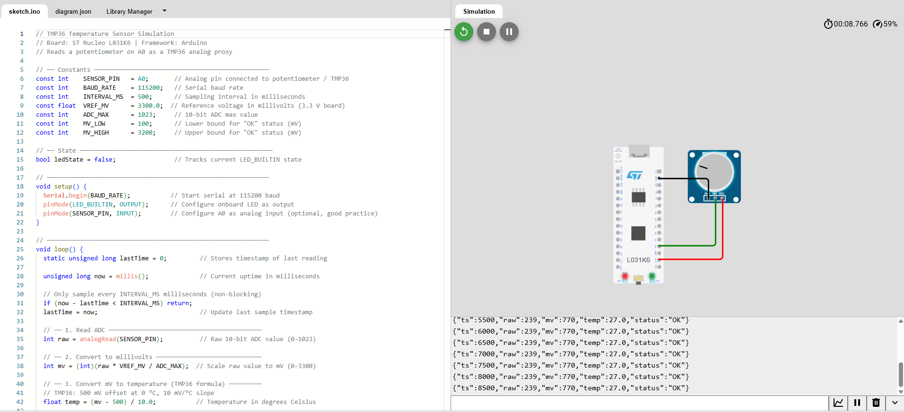
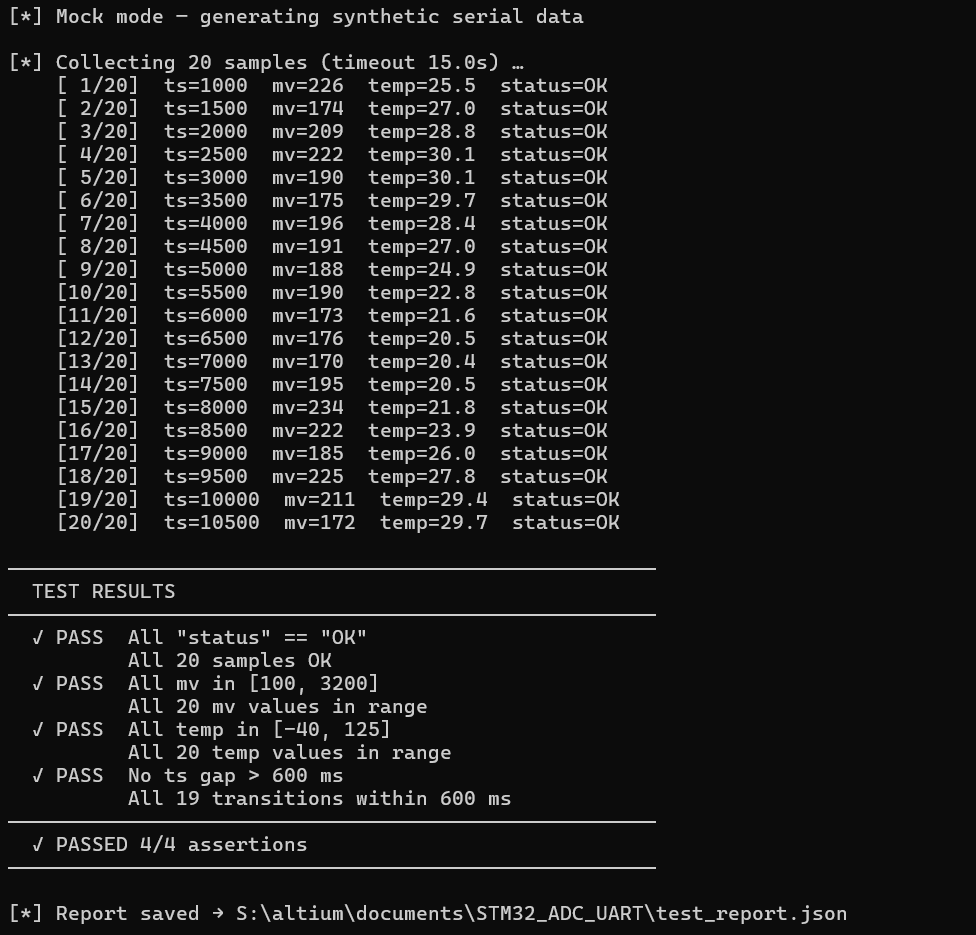
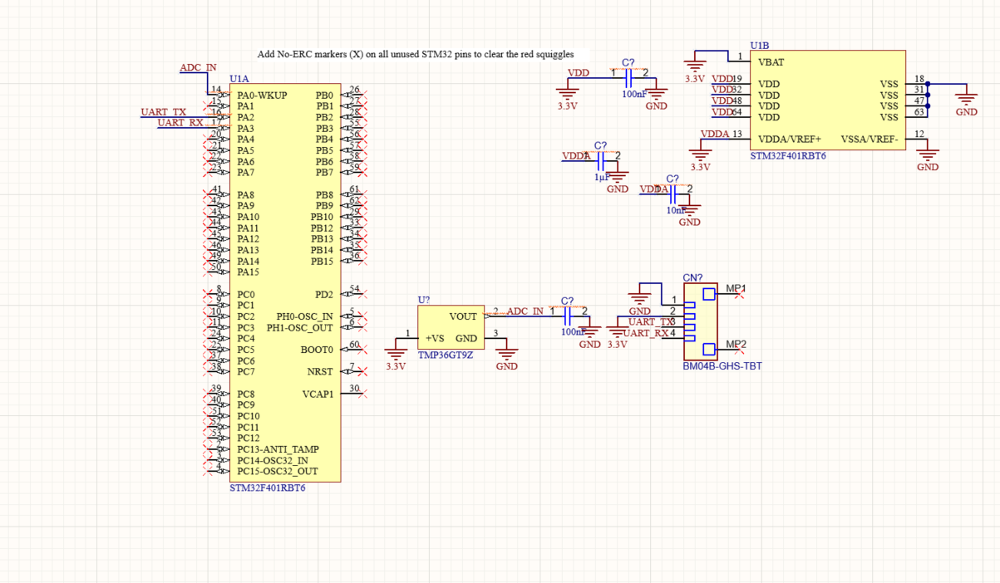

# STM32 ADC UART HIL — AI-Accelerated EE Workflow

## What this project does
Bare-metal STM32 firmware that reads a TMP36 temperature 
sensor via ADC and sends structured JSON data over UART 
every 500ms. Includes a Python automated HIL test script 
that validates all output — PASSED 4/4 assertions.

## Tools used
| Tool | Purpose |
|---|---|
| Altium Designer | Schematic + PCB design |
| Wokwi | STM32 firmware simulation |
| Python + pyserial | Automated HIL test script |
| Claude | Schematic review + code generation |

## Results




## Project structure
```
├── sketch.ino              # STM32 firmware (Arduino/Wokwi)
├── stm32_serial_test.py    # Python HIL test script
├── test_report.json        # Auto-generated test report
└── altium/                 # Schematic screenshots
```

## AI workflow log

### 1. Schematic review
**Prompt used:** Asked Claude to review STM32F401 + TMP36 
schematic connections.

**What Claude found:**
- Missing VDDA decoupling caps (1µF + 10nF)
- Missing VDD bypass caps on all 4 VDD pins
- No series resistor on ADC input
- NRST filter cap missing

**What I fixed:** Added VDDA and VDD decoupling caps.
**Time saved:** ~1 hour vs manual datasheet review.

### 2. Firmware generation
**Prompt used:** Asked Claude to generate STM32 firmware 
for ADC reading + JSON UART output.

**What Claude generated correctly:** Full working firmware 
on first attempt — ADC init, UART init, JSON formatting, 
LED toggle, 500ms timing.

**Time saved:** ~2 hours.

### 3. Python HIL test script
**Prompt used:** Asked Claude to write pyserial test script 
with --mock flag, 4 assertions, JSON report output.

**Result:** Ran with --mock on first try. PASSED 4/4 
assertions. Auto-saves test_report.json.

**Time saved:** ~1.5 hours.

## How to run the test
```bash
# Mock mode (no hardware needed)
python stm32_serial_test.py --mock

# Real hardware
python stm32_serial_test.py --port COM3
```

## Why this project
Built as a weekend project to demonstrate AI-accelerated 
EE workflows — schematic design, firmware development, 
and automated testing — using Claude throughout.
